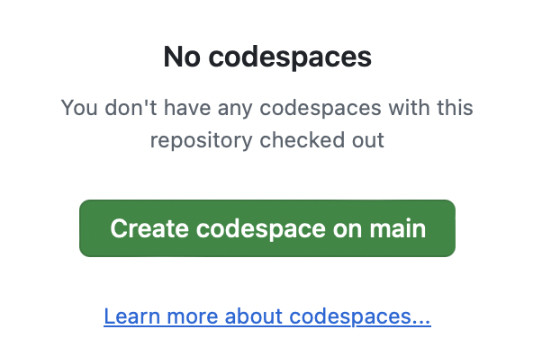

# Interactive React for the Web

This is the repository for the LinkedIn Learning course `Interactive React for the Web`. The full course is available from [LinkedIn Learning][lil-course-url].

_See the readme file in the main branch for updated instructions and information._

## Instructions

This repository has folders for each of the chapters and videos in the course where exercise files are needed.  The structure is `CHAPTER#.MOVIE#`, with an equivalent `CHAPTER#.MOVIE#-end` for the files as they are at the end of that movie.

## Installing

This course is delivered using GitHub Codespaces, so no installation is required.  Fork the repository to your own GitHub account, then click the Code button, switch to the Codespaces tab and click the "Create Codespace on main" button.



### Offline installation

While it is easy, you don't have to use Codespaces to use these files.  If you download the files from GitHub, you can start a local Dev Container in Visual Studio Code.  [The VSC documentation on Dev Containers](https://code.visualstudio.com/docs/devcontainers/tutorial) has all the requirements you'll need to do this.  Once those requirements are installed, you can start the dev container and enjoy.

## Installed Software

This project includes [Vite](https://vite.dev) for processing the React code into JavaScript, and [Hono](https://hono.dev) to running the API that powers one of the chapters.

### Status API

This tiny [Hono](https://hono.dev/) app saves and serves status messages.  It is just enough to support the coursework, and is *not* meant to be used live on the internet.

For example, there is no data validation, no authentication, and no protection against spam.  Feel free to use it as a starting point, but it will take a lot of work to be ready for production.

If used outside a Dev Container, you can install and try it like this:

```
npm install
npm run dev
```

Then you'll be able to see it running in a web browser:

```
open http://localhost:4000
```

[lil-course-url]: https://www.linkedin.com/learning/